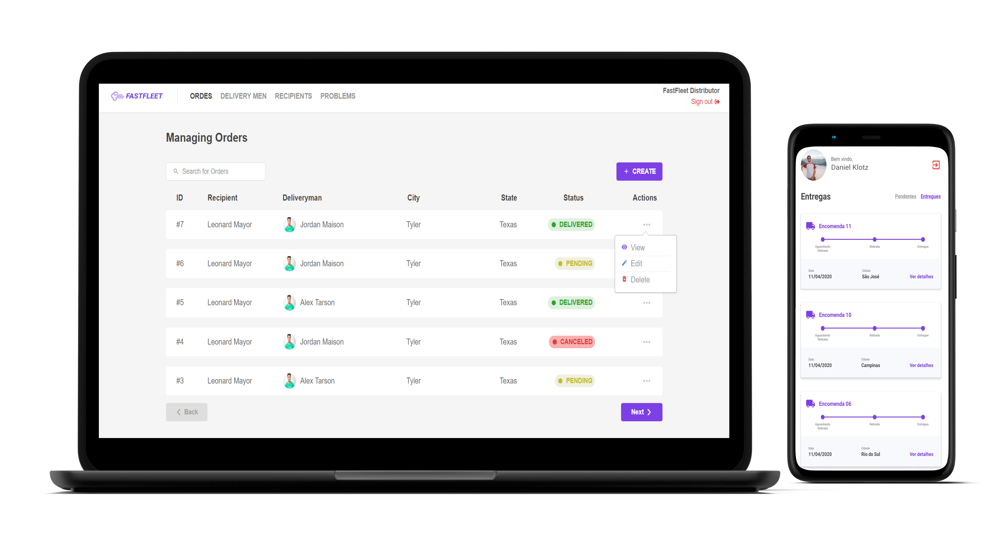

# Fastfleet is a fictitious logistic company.

### :books: This is a study project made for fun using React, React Native and Node.js.



### :collision: Tech Stack

- React.Js
- Redux
- Socket.io
- Mongodb
- Sequelize
- Jsonwebtoken
- Node.JS
- Multer
- Redis
- postgress
- docker
- Express
- React Native
- Expo

## :electric_plug: Prerequisites

- [Node.js LTS (>= 12.x)](https://nodejs.org/)
- [Yarn (>= 1.21)](https://yarnpkg.com/) or [NPM (>= 6.9)](https://www.npmjs.com/)
- [Docker CE (>= 19.03.3)](https://docs.docker.com/install/)

# :closed_lock_with_key: API Instructions

First get all the requirements installed on your system.
In order to run the APIs, you need to use some Docker Images like [PostgreSQL](https://hub.docker.com/_/postgres) and [Redis](https://hub.docker.com/_/redis/).

Start the docker images dependencies:

```shell
# Change the <password> below and on .env file to run PostgreSQL
$ sudo docker run --name fastfleet -e POSTGRES_PASSWORD=<password> -p 5432:5432 -d postgres:11

# Execute the Redis docker
$ sudo docker run --name redisfastfleet -p 6379:6379 -d -t redis:alpine
```

### Getting started the API Restful backend

Make a clone from the repo and install the dependencies

```shell

# After clone this repo, enter in the API folder
$ cd api

# Install all dependencies using Yarn
$ yarn
```

Certify yourself that all environments are correct

```shell
# Copy the .env folder
$ cp .env.example .env

# Insert your environments into .env file
$ nano .env

```

Prepare the PostgreSQL database

```shell
# Migrate the database
$ yarn sequelize db:migrate

# Run the seeds
$ yarn sequelize db:seed:all
```

Start the project

```shell
# Run the development server
$ yarn dev

# Case the output appears like this, you are set to go
yarn run v1.19.1
$ nodemon src/server.js
[nodemon] 2.0.2
[nodemon] to restart at any time, enter `rs`
[nodemon] watching dir(s): *.*
[nodemon] watching extensions: js,mjs,json
[nodemon] starting `node -r sucrase/register src/server.js`

# The backend will run on port 3333
# https://localhost:3333
```

In a new terminal, run the queue

```shell
# Run the queue to enable mails and dependencies that uses bee-queue
$ yarn queue

# Case the output appears like this, is all ok
yarn run v1.19.1
$ nodemon src/queue.js
[nodemon] 2.0.2
[nodemon] to restart at any time, enter `rs`
[nodemon] watching dir(s): *.*
[nodemon] watching extensions: js,mjs,json
[nodemon] starting `node -r sucrase/register src/queue.js`
```

# :computer: Web Application instruction

```shell
# After clone this repo, enter in the Web folder
$ cd web

# Install all dependencies using Yarn
$ yarn

# Run the project
$ yarn start
```

# :iphone: Mobile App instructions (Has not been tested on iOS)

Make a clone from the repo and install the dependencies

```shell
# After clone this repo, enter in the DevRadar folder
$ cd fastfleet-app

# Install all dependencies using Yarn
$ yarn

# Run the react native metro bundle
$ react-native start

# Run the project
$ react-native run-android
```

<hr/>

### <a href="http://linkedin.com/in/danielfelipeklotz">Contact me on LinkedIn</a>